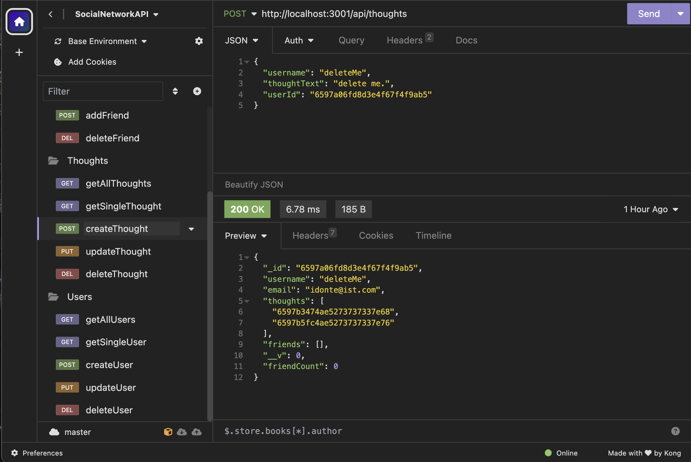
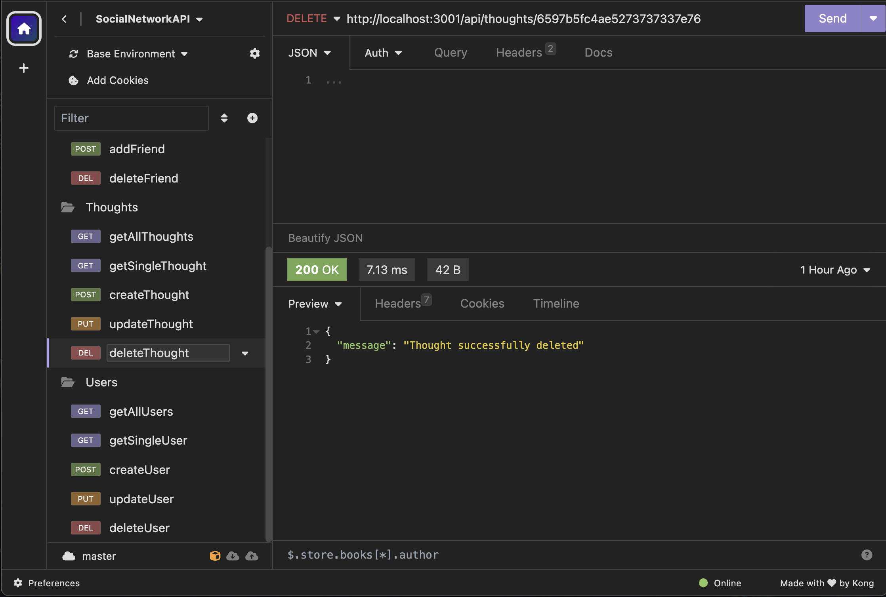
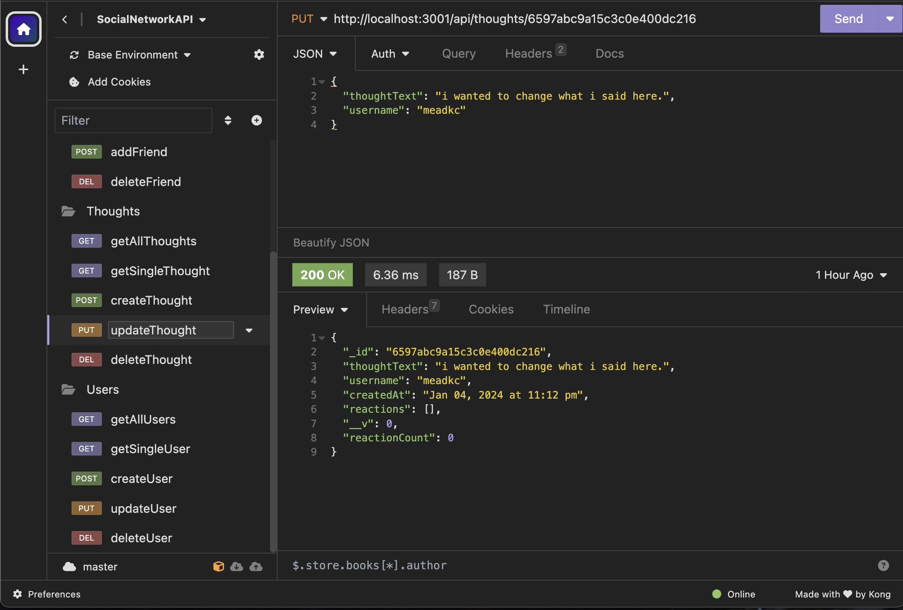
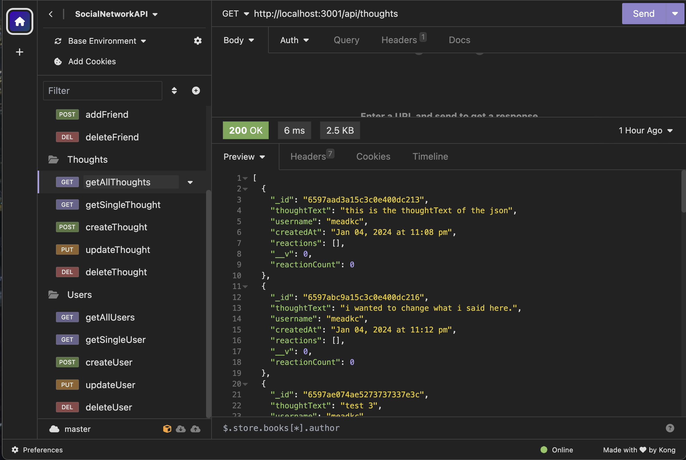
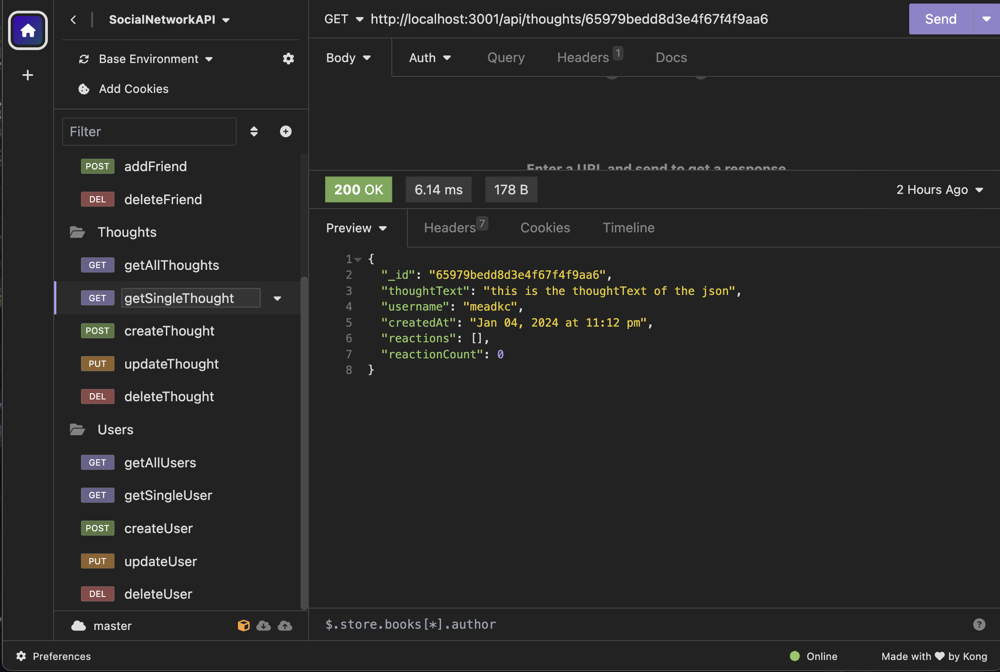
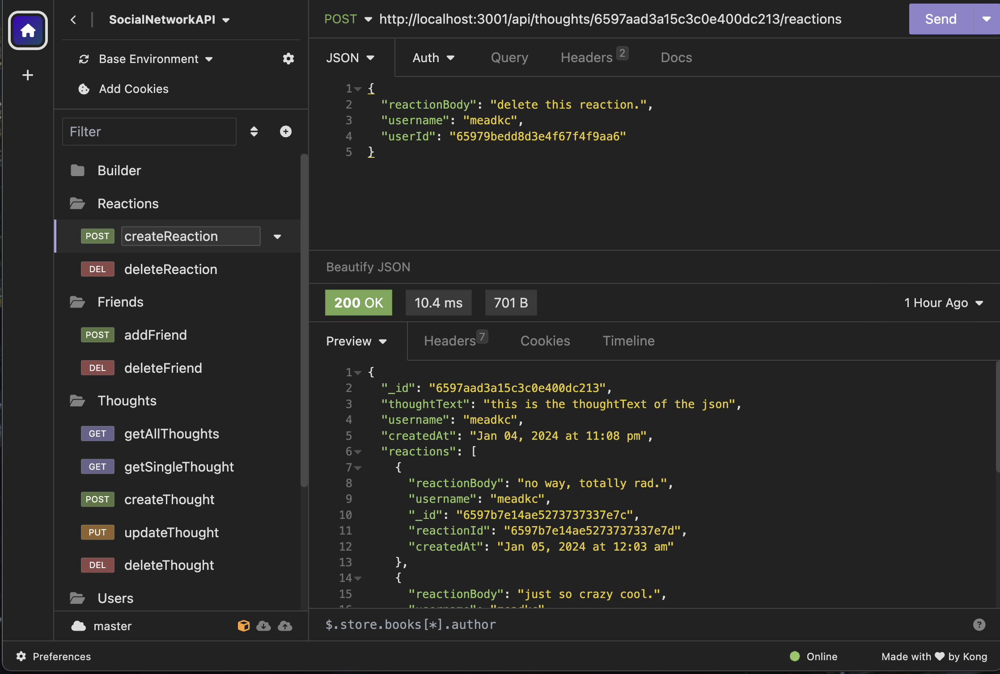
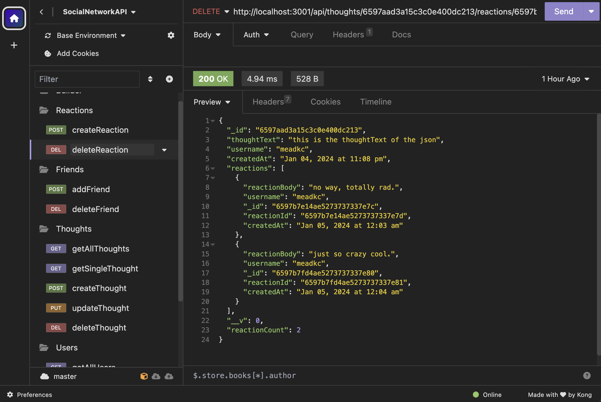

# Social Network API

## Description
[](https://opensource.org/licenses/MIT)

Welcome to the Social Network API, a robust backend solution designed for social media startups seeking seamless scalability and performance. This API employs a NoSQL database, MongoDB, to efficiently handle vast amounts of unstructured data, providing the foundation for your dynamic and interactive website. By running a simple command, the server initializes, and Mongoose models synchronize effortlessly with the MongoDB database. 

Leveraging Insomnia for API testing, users can explore GET routes, displaying user and thought data in neatly formatted JSON. The API goes beyond read operations, enabling the creation, updating, and deletion of users and thoughts through intuitive POST, PUT, and DELETE routes. 

For an enhanced social experience, the API supports the creation and deletion of reactions to thoughts, along with the addition and removal of friends from a user's friend list. Elevate your social network platform with this flexible and powerful API, ready to fuel your startup's journey.

## Table of Contents

1. [Features](#features)
2. [Technologies Used](#technologies_used) 
3. [Getting Started](#getting_started)
4. [Usage & Testing](#usage)
5. [Visual Examples](#visual_examples)
6. [Questions](#questions)
7. [License](#license)
8. [Author](#author)


## Features

  - **NoSQL Database**: The Social Network API is powered by MongoDB, a NoSQL database, providing the flexibility to handle large volumes of unstructured data inherent in social media interactions.
  - **Comprehensive API Endpoints**: Explore a range of API endpoints, including GET routes for users and thoughts, showcasing data in a well-formatted JSON format.
  - **CRUD Operations**: Test and execute CRUD operations easily with API routes for creating, updating, and deleting both users and thoughts, providing full control over your social network's data.
  - **Reaction Management**: Enhance user interactions with the ability to create and delete reactions to thoughts.
  - **Friend List Manipulation**: Enable users to manage their connections by adding and removing friends to and from their friend list.
  - **Insomnia Testing**: Seamlessly integrate with Insomnia for API testing for interacting with different routes and functionalities.
  - **Robust and Flexible Architecture**: Built on Express.js and Mongoose, a solid foundation for developers to customize and expand based on evolving requirements.
  - **Timestamp Formatting**: Utilize Moment.js for accurate timestamp formatting, ensuring clear and user-friendly timestamps associated with user activities.

## Technologies Used

Express.js provides a solid foundation for handling HTTP requests and defining routes, Moment.js simplifies date handling, and Mongoose streamlines the interaction with MongoDB, a popular NoSQL database.

**Express.js**: A web framework for Node.js, ideal for building robust and scalable APIs. It simplifies the process of handling HTTP requests, routing, and middleware integration.

**Moment.js**: A JavaScript library for parsing, validating, manipulating, and formatting dates. In the context of the Social Network API, Moment.js is used for handling and formatting timestamps associated with thought submissions.

**Mongoose**: An Object Data Modeling (ODM) library for MongoDB and Node.js. It provides a way to interact with MongoDB databases, defining schemas, models, and facilitating data validation. In the context of the Social Network API, Mongoose is used to model and structure the data for integration with MongoDB.

## Getting Started

Follow these simple steps to get started with the Social Network API:

**1. Prerequisites:**
   - Ensure that you have Node.js and npm installed on your machine. If not, download and install them from [Node.js official website](https://nodejs.org/).

**2. Clone the Repository:**
   - Clone the Social Network API repository to your local machine using the following command:
     ```bash
     git clone https://github.com/kcmead/social-network-api.git
     ```

**3. Install Dependencies:**
   - Navigate to the project directory and install the required dependencies by running:
     ```bash
     npm install
     ```

**4. Set Up MongoDB:**
   - Make sure you have MongoDB installed locally or set up a remote MongoDB instance. Update the `MongoDB connection string` in the `config/connection.js` file if needed.

**5. Run the Application:**
   - Start the server by running the following command:
     ```bash
     npm start
     ```

**6. Test with Insomnia:**
   - Open your preferred API testing tool (e.g., Insomnia) and explore the available endpoints for users, thoughts, reactions, and friend list operations.

**7. API Routes:**
   - Familiarize yourself with the API routes documented in the README, specifying GET, POST, PUT, and DELETE operations for users, thoughts, reactions, and friend-related actions.

**8. Customize and Expand:**
   - Modify the code to suit the specific requirements of your social network. Leverage the robust architecture to add new features or extend existing functionalities.

**9. Documentation:**
   - Refer to the provided documentation for detailed information on API routes, data models, and usage guidelines.

**10. Start Building:**
   - With the API up and running, start building your social media platform, leveraging the powerful features and flexibility provided by the Social Network API.

Congratulations! You are now set up to harness the capabilities of the Social Network API for your social media startup. Dive into the code, explore the API, and begin shaping your unique online community.


## Usage & Testing

Ensure the proper functionality of the Social Network API by running the following tests:

#### 1. GET Routes

- Open your API testing tool (e.g., [Insomnia](https://insomnia.rest/)).
- Make GET requests to `/api/users` and `/api/thoughts`.
- Verify that the responses display user and thought data in a well-formatted JSON format.

#### 2. CRUD Operations

- Test API POST, PUT, and DELETE routes for users and thoughts.
- Ensure successful creation, updating, and deletion of user and thought data.
- Verify that the corresponding changes are reflected in the MongoDB database.

#### 3. Reactions

- Test API POST and DELETE routes for reactions to thoughts.
- Confirm the creation and deletion of reactions associated with specific thoughts.

#### 4. Friend List Management

- Test API routes for adding and removing friends from a user's friend list.
- Verify that the friend list is correctly modified in the database.

#### 5. Error Handling

- Trigger intentional errors by providing invalid data or making requests to non-existent routes.
- Confirm that the API returns appropriate error responses with meaningful error messages.

#### 6. Timestamp Formatting

- Verify that timestamps for user activities are correctly formatted using Moment.js.
- Confirm consistent and user-friendly timestamps in API responses.

Run these tests to ensure the robustness and reliability of the Social Network API. Refer to the documentation for additional details on each API route.

## Visual Examples

- **Users and Friends**
  - [CREATE user](#create-user)
  - [DELETE user (and thoughts)](#delete-user-and-thoughts)
  - [UPDATE user](#update-user)
  - [GET all users](#get-all-users)
  - [GET single user](#get-single-user)
  - [ADD friend](#add-friend)
  - [DELETE friend](#delete-friend)
- **Thoughts and Reactions**
  - [CREATE thought](#create-thought)
  - [DELETE thought](#delete-thought)
  - [UPDATE thought](#update-thought)
  - [GET all thoughts](#get-all-thoughts)
  - [GET single thought](#get-single-thought)
  - [CREATE reaction](#create-reaction)
  - [DELETE reaction](#delete-reaction)
- **Video Demo**
  - [Example Usage](#example-usage)

#### User
   #### create user
   
   [back to visual examples list](#visual-examples)
   #### delete user (and thoughts)
   
   [back to visual examples list](#visual-examples)
   #### update user
   
   [back to visual examples list](#visual-examples)
   #### get all users
   
   [back to visual examples list](#visual-examples)
   #### get single user
   
   [back to visual examples list](#visual-examples)
   #### add friend
   
   [back to visual examples list](#visual-examples)
   #### delete friend
   
   [back to visual examples list](#visual-examples)
#### Thought
   #### create thought
   
   [back to visual examples list](#visual-examples)
   #### delete thought
   
   [back to visual examples list](#visual-examples)
   #### update thought
   
   [back to visual examples list](#visual-examples)
   #### get all thoughts
   
   [back to visual examples list](#visual-examples)
   #### get single thought
   
   [back to visual examples list](#visual-examples)
   #### create reaction
   
   [back to visual examples list](#visual-examples)
   #### delete reaction
   
   [back to visual examples list](#visual-examples)
#### Video
   #### Example Usage
   [(./public/assets/Social%20Network%20API%20Demo.mp4)]
   [back to visual examples list](#visual-examples)


## Questions

Please direct your questions to the author, Kevin Mead. 


## License

[](https://opensource.org/licenses/MIT)

MIT License

Copyright (c) [2024] [Kevin Mead]

Permission is hereby granted, free of charge, to any person obtaining a copy
of this software and associated documentation files (the "Software"), to deal
in the Software without restriction, including without limitation the rights
to use, copy, modify, merge, publish, distribute, sublicense, and/or sell
copies of the Software, and to permit persons to whom the Software is
furnished to do so, subject to the following conditions:

The above copyright notice and this permission notice shall be included in all
copies or substantial portions of the Software.

THE SOFTWARE IS PROVIDED "AS IS", WITHOUT WARRANTY OF ANY KIND, EXPRESS OR
IMPLIED, INCLUDING BUT NOT LIMITED TO THE WARRANTIES OF MERCHANTABILITY,
FITNESS FOR A PARTICULAR PURPOSE AND NONINFRINGEMENT. IN NO EVENT SHALL THE
AUTHORS OR COPYRIGHT HOLDERS BE LIABLE FOR ANY CLAIM, DAMAGES OR OTHER
LIABILITY, WHETHER IN AN ACTION OF CONTRACT, TORT OR OTHERWISE, ARISING FROM,
OUT OF OR IN CONNECTION WITH THE SOFTWARE OR THE USE OR OTHER DEALINGS IN THE
SOFTWARE.


## Author

Kevin Mead
